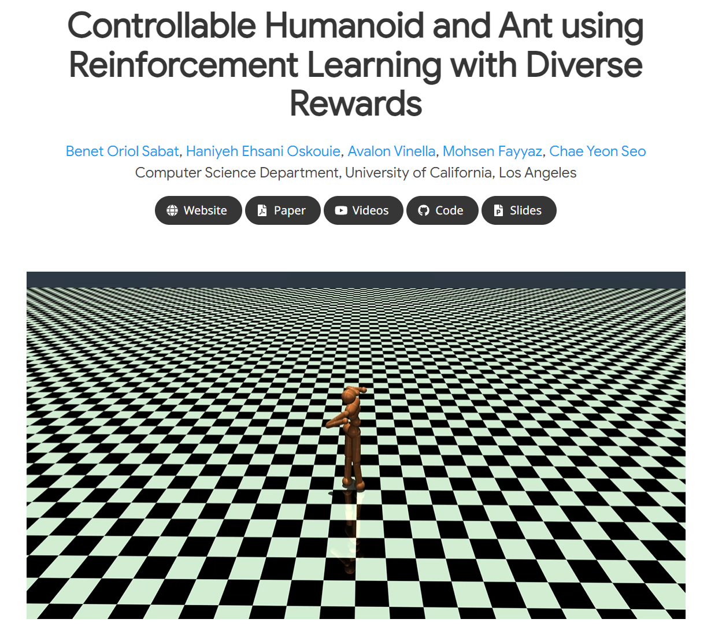

# CS275: Artificial Life in Computer Graphics
## Website: https://mohsenfayyaz.github.io/cs275/


```
* Add new envs as a new file in src/envs/ and register it in src/envs/__init__.py
```

```
Tensorboard:
python -m tensorboard.main --logdir=./tensorboard/
```

```shell
# In cs275/
python -m src.demo
```